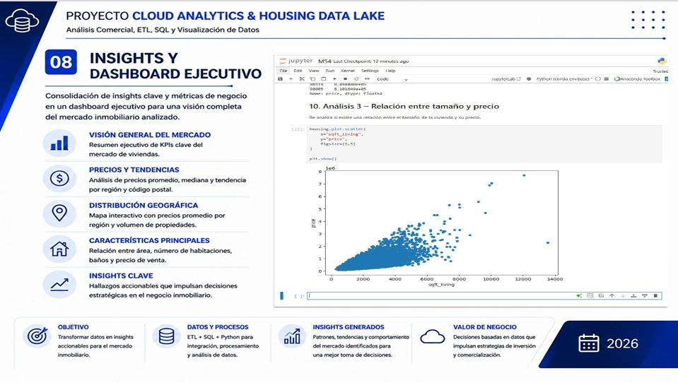
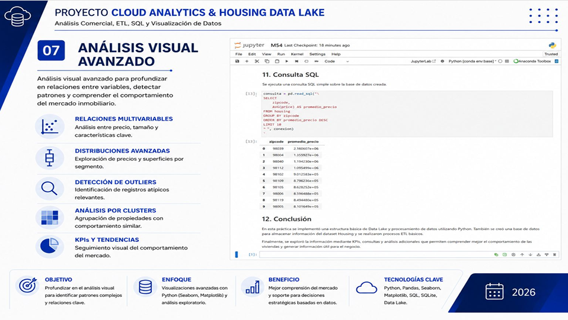
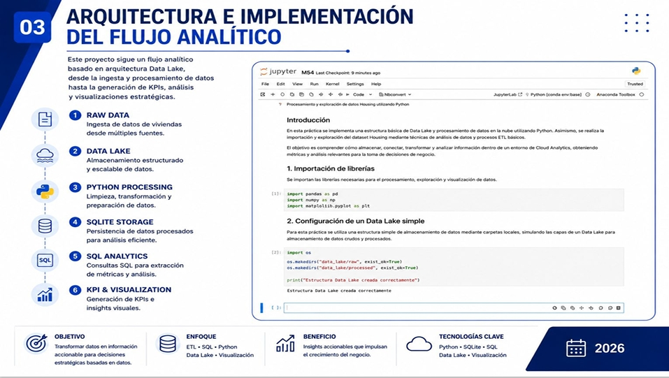

# ☁️ Cloud Analytics & Housing Data Lake

## Overview

This project simulates a cloud-based analytics environment using Data Lake principles to process, store, analyze, and visualize housing market data.

Through the implementation of ETL processes, SQL analytics, Python data processing, and KPI generation, raw housing data was transformed into actionable business insights that support strategic decision-making in the real estate sector.

---

## Business Problem

Real estate organizations generate large volumes of data that often remain underutilized due to the lack of a structured analytical workflow.

A scalable architecture is required to centralize information, process data efficiently, and generate meaningful insights that can improve market understanding and business performance.

### Business Question

How can housing market data be leveraged through a Data Lake-based workflow to generate strategic insights, business KPIs, and support data-driven decision-making?

---

## Project Objectives

- Simulate a cloud analytics environment using Data Lake principles.
- Design and implement an ETL workflow.
- Store and process housing market data efficiently.
- Perform SQL analytics to generate business metrics.
- Create KPIs and visualizations for decision-making.
- Transform raw data into actionable business insights.

---

## Data Source

### Dataset

Housing market dataset containing residential property information, including:

- Property prices
- Square footage
- Number of bedrooms
- Number of bathrooms
- Geographic location
- Postal codes
- Additional housing characteristics

### Data Structure

- Structured housing records
- Tabular format
- Multiple business attributes for analysis

---

## Tools & Technologies

- Python
- Pandas
- SQLite
- SQL
- ETL Workflow
- Data Lake Architecture
- Matplotlib
- Seaborn
- Jupyter Notebook
- Git & GitHub

---

## Methodology

### 1. Data Lake Simulation

A simplified Data Lake architecture was designed to organize raw and processed housing data.

- Layers
- Raw Data
- Processed Data
- Analytics Layer

### 2. ETL Implementation

An ETL workflow was developed to:

- Extract housing data
- Clean and transform records
- Prepare data for analytical processing
- Ensure data consistency and quality

### 3. Database Storage

SQLite was implemented as a lightweight analytical database to store processed information and support SQL queries.

### 4. SQL Analytics

SQL queries were used to generate business metrics such as:

- Average property prices
- Average construction area
- Bedroom distribution
- Geographic comparisons
- Postal code analysis

### 5. Exploratory Data Analysis

Python and visualization libraries were used to identify:

- Price distributions
- Market trends
- Geographic differences
- Property characteristics
- Relationships between variables

### 6. KPI Generation

Business KPIs were calculated to evaluate the overall behavior of the housing market and support strategic analysis.

---

## Key Findings

### Price Variation by Location

Significant differences in housing prices were identified across geographic regions and postal codes.

### Property Size and Price Relationship

Larger properties generally showed higher market values, indicating a strong relationship between size and pricing.

### Market Segmentation Opportunities

The analysis revealed distinct market segments with different pricing behaviors and characteristics.

### Geographic Insights

Location proved to be one of the most influential factors affecting property values.

### Business KPIs

The generated KPIs provided a comprehensive overview of housing market performance and opportunities.

---

## Dashboard & Visualizations

The following visualizations summarize the analytical workflow, business KPIs, and strategic insights generated throughout the project.

### Executive Dashboard & Business Insights
<p align="center">
  
</p>

### Advanced Visual Analysis
<p align="center">
  
</p>

### Data Lake Architecture & Analytics Workflow
<p align="center">
  
</p>

---

## Business Impact

The results generated by this project can support:

- Better understanding of housing market behavior.
- More informed investment decisions.
- Identification of high-value market segments.
- Improved monitoring of real estate trends.
- Enhanced KPI-driven decision-making.
- Stronger analytical capabilities through Data Lake architecture.

---

## Project Limitations

- The project uses a simulated Data Lake environment rather than a cloud-native platform.
- Analysis is based on the available housing dataset and may not represent all market conditions.
- Predictive models were not implemented in this phase.
- Additional socioeconomic and demographic variables could improve analytical depth.

---

## Lessons Learned

Throughout this project, I strengthened my skills in:

- Data Lake architecture concepts.
- ETL design and implementation.
- SQL-based business analytics.
- Python data processing and transformation.
- KPI generation and reporting.
- Data visualization for decision-making.
- Translating analytical outputs into business insights.

---

## Challenges

- Designing a scalable analytical workflow.
- Organizing data within a Data Lake structure.
- Ensuring data quality during ETL processes.
- Integrating Python, SQL, and visualization tools.
- Converting technical results into actionable business recommendations.

---

## Recommendations

- Expand the Data Lake architecture using cloud-native services.
- Incorporate predictive analytics and forecasting models.
- Integrate additional geographic and socioeconomic variables.
- Develop interactive dashboards for real-time monitoring.
- Automate ETL processes for continuous data updates.

---

## Conclusion

This project successfully implemented a complete Cloud Analytics workflow by combining Data Lake principles, ETL processes, SQL analytics, and data visualization techniques. The resulting insights transformed raw housing data into strategic business information, demonstrating how modern analytical architectures can support smarter and more effective decision-making in the real estate industry.

---

## Repository Structure

```text
cloud-analytics-housing-data-lake
├── README.md
├── notebooks
│   └── cloud-analytics-housing-data-lake.ipynb
├── report
│   └── cloud-analytics-housing-data-lake.pdf
└── Images
    ├── executive-dashboard.png
    ├── advanced-visual-analysis.png
    └── data-lake-architecture.png
```

---

## Author

*Ali Vega*  
Data Analytics • Cloud Analytics
